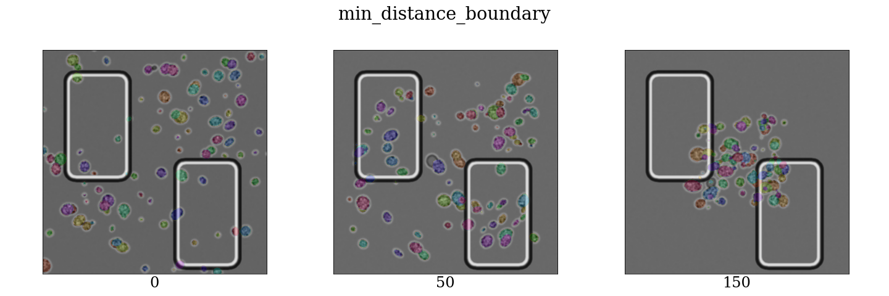
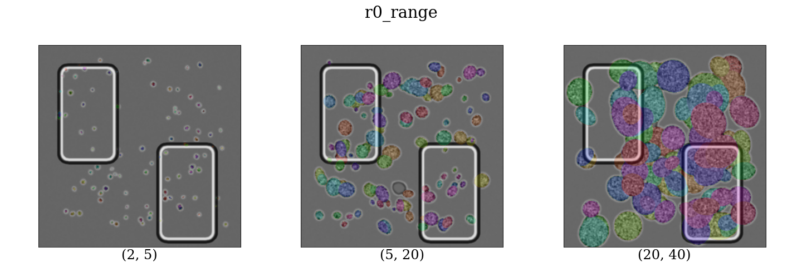
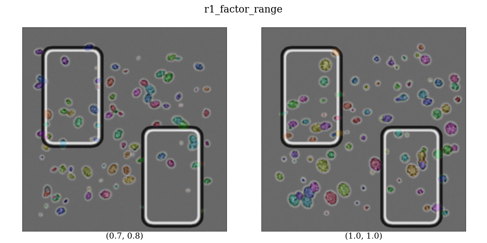
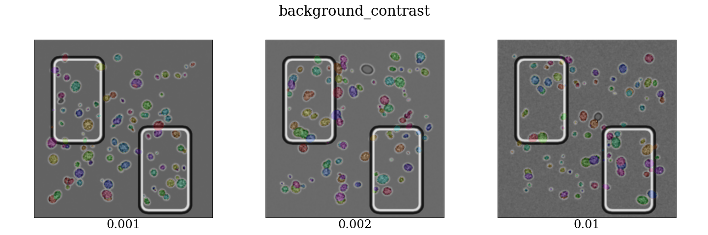
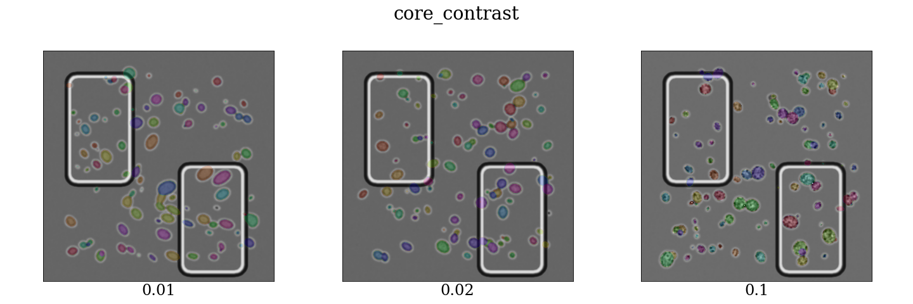
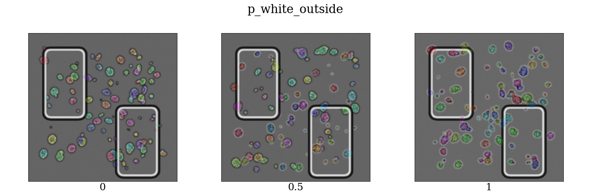

# Installation

Make sure cuda-10-1 and cudnn are installed. They are needed to create the 

    pip3 install -U torch==1.7.0 torchvision==0.8.1 detectron2 scikit-image u-msgpack-python -f https://dl.fbaipublicfiles.com/detectron2/wheels/cu101/index.html
    pip3 install .../synthetic-yeast-cells/

# Usage

## Minimal example

[notebook](notebooks/Example%20synthetic%20samples.ipynb)

A minimal run to create synthetic brightfield images of
yeast cells is by only specifying how many samples should
be generated. The other parameters are considered at their
defaults.

```python3
from syntheticyeastcells import create_samples

images, labels = create_samples(100)
```

## Example with all parameters

[notebook](notebooks/Example%20parameter%20settings.ipynb)

Alternatively you can specify these parameters to tweak
the properties of the images. This example shows the
default values

```python3
images, labels = create_samples(
  # number of samples to create:
  n_images=len(axes),

  # number of cells per image
  n_cells_per_image=100,

  # image dimensions (height, width)
  size=(512, 512),

  # area at the boundary to not have cells
  min_distance_boundary=50,

  # range for the first radius of the ellipse as
  # an approximate of a cell, from which is sampled
  # uniformly
  r0_range=(2, 14),

  # range for the second radius of the ellipse as
  # an approximate of a cell as a factor of the first
  # radius, from which is sampled uniformly.
  r1_factor_range=(0.7, 1.3),

  # the background consists of gaussian noise, blurred by this
  # standard deviation.
  spatial_blur_std=1.5,

  # expected background greyscale, assuming a [0, 1] range
  background_intensity=0.4,

  # standard deviation of the noise outside of cells
  background_contrast=0.00188,

  # standard deviation of the noise inside cells
  core_contrast=0.0282,

  # probability the outside of a cell is white, and the
  # inside is white, instead of the other way around.
  p_white_outside=0.5
)
```

## Example outputs for all parameters















## Output

`images` is a $n_images \times height \times width \times 3$ greyscale stack of images encoded as uint8,
and `labels` is a $n_images \times height \times width$ stack of labels encoded as uint32. Each cell
is encoded as a different integer and the background is encoded as `0`.

```python3
from matplotlib import pyplot

axes = pyplot.subplots(3, 3, figsize=(30, 30))[1].ravel()

# Change the labels to rgba colors
colors = pyplot.get_cmap('hsv')(numpy.linspace(0, 1, labels.max() + 1))
colors[0] = [0, 0, 0, 0] # background is fully transparent.
colors[1:, 3] = 0.2
colors = (colors[labels] * 255).astype(numpy.uint8)

for axis, image, label in zip(axes, images, colors):
  axis.imshow(image)
  axis.imshow(label)
```

## Create a dataset suitable for detectron2

[notebook](notebooks/Create%20a%20data%20set%20for%20detectron2%20Mask-RCNN.ipynb)

```python3
from syntheticyeastcells.detectron2 import create_dataset

synthetic_data_folder = (
  '/slow-data/p253591/yeast cells/data/synthetic/v7')

create_dataset(
  # Where to store the data set
  synthetic_data_folder,

  # sizesof several subsets
  sets={'test': 1000, 'val': 1000, 'train': 20000},

  # same parameters as before
  n_cells_per_image=100,
  size=(512, 512),
  min_distance_boundary=50,
  r0_range=(2, 14),
  r1_factor_range=(0.7, 1.3),
  spatial_blur_std=1.5,
  background_intensity=0.4,
  background_contrast=0.00188,
  core_contrast=0.0752,
  p_white_outside=0.5,

  # number of processes to run in parallel, number of samples created in one batch
  njobs=40, batch_size=1,

  # show a progressbar
  progressbar=True)

with open(f'{synthetic_data_folder}/labels.json', 'w') as f:
  json.dump(labels, f)
```

This results in these files:

    ls '{synthetic_data_folder}/'*    
    /slow-data/p253591/yeast cells/data/synthetic/v8/labels.json

    /slow-data/p253591/yeast cells/data/synthetic/v8/test:
    image-0.jpg  image-1.jpg  image-2.jpg

    /slow-data/p253591/yeast cells/data/synthetic/v8/train:
    image-0.jpg  image-2.jpg  image-4.jpg  image-6.jpg  image-8.jpg
    image-1.jpg  image-3.jpg  image-5.jpg  image-7.jpg  image-9.jpg

    /slow-data/p253591/yeast cells/data/synthetic/v8/val:
    image-0.jpg  image-1.jpg  image-2.jpg
    
    
    cat '{synthetic_data_folder}/labels.json'
    {"test": [{"height": 512, "width": 512, "annotations": [{"bbox": [421.5, 139.5, 434.5, 154.5], "bbox_mode": 0, "segmentation": [[ ... ]], "category_id": 0, "iscrowd": 0}, ...., "valid": ...., "train": ...}
